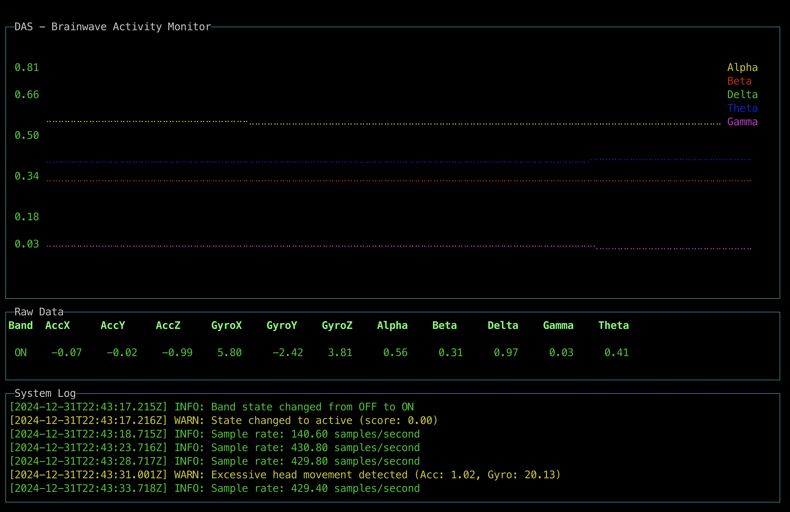

# moose-brain-mapping
Moose powered Brain Mapping Demo

## Introduction

This is a demo of a data intensive Brain Mapping application that uses Moose and the Muse Headband.

[Moose](https://getmoose.com) is an application / infrastructure tool that simplifies the creation of data intensive applications. It's a product that a few of us over at [514 Labs](https://fiveonefour.com) have been building as an [open source tool](https://github.com/514-labs/moose). 

The [Muse Headband](https://choosemuse.com) is a wearable device that measures brainwave activity. It is a small, comfortable band that you wear on your head. It has 4 sensors that measure the electrical activity of your brain.

To allow Moose and the Muse Headband to communicate, we use a UDP Datagram Protocol (UDP) server called DAS (Data Acquisition Service) to receive UDP packets from an app that connects to the Muse Headband.

The DAS service is a Node.js application that uses the [osc-min](https://github.com/colinbdclark/osc-min) library to parse the UDP packets and send them via HTTP to the Moose server.

Moose in-turn ingests the data and uses [RedPanda](https://redpanda.com) and the  [Clickhouse](https://clickhouse.com) database. 

